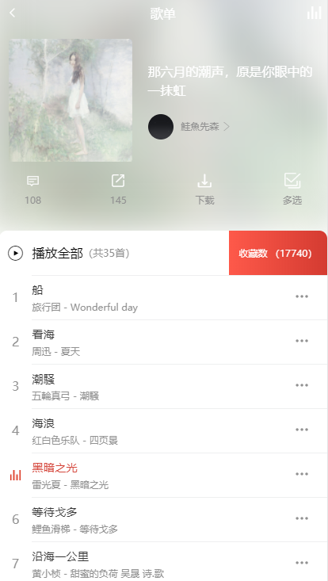
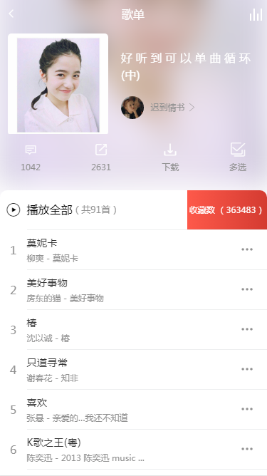
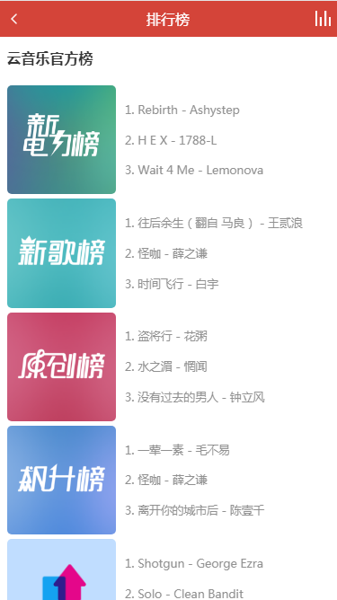
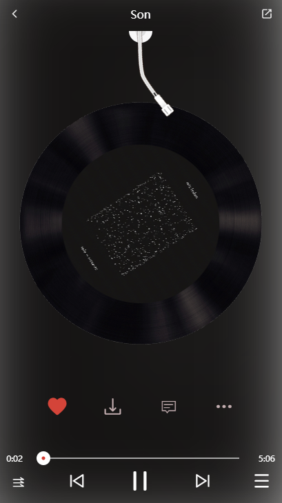
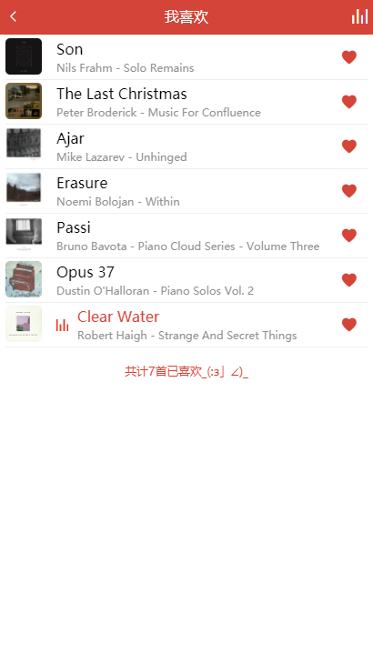
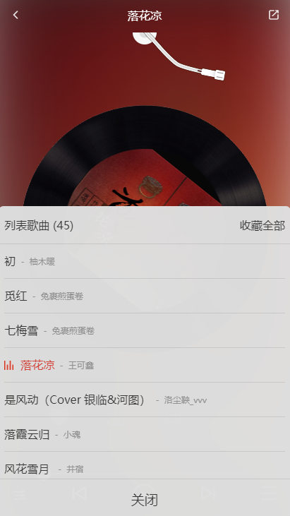
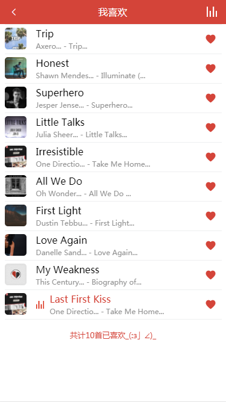
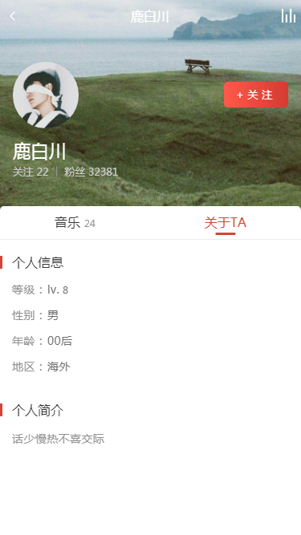

# vue-cloud-music
基于vue + vuex + vue-router + axios的网易云音乐

## 前瞻图











## 关键信息
项目启发于：[CaiJinyc / vue-music-webapp](https://github.com/CaiJinyc/vue-music-webapp)

后台api使用：[Binaryify / NeteaseCloudMusicApi](https://github.com/Binaryify/NeteaseCloudMusicApi)

ui界面基于ios版，version：5.2.0

项目完成度：(80%？)

## 前言碎语
由于个人原因无法提供在线演示地址，不排除以后会提供，现阶段如果想查看演示的话只能clone本项目。

此项目需要基于[Binaryify](https://github.com/Binaryify/NeteaseCloudMusicApi)的node后台API，所以如果clone了，你还需要继续clone一份[Binaryify](https://github.com/Binaryify/NeteaseCloudMusicApi)的后台api方可（**别忘了启服务**）。

注意：(由于[Binaryify](https://github.com/Binaryify/NeteaseCloudMusicApi)的后台api持续不断迭代，不同版本之间的api可能会造成前端axios返回的**数据格式**不同，一旦出现了**报错**或者**数据无法正常加载**很可能就是版本不同的原因，请立即**提issue**给本人_(:з」∠)_ ， 另外欢迎pr提出任何你觉得**不足/可改进**的地方⁄(⁄ ⁄•⁄ω⁄•⁄ ⁄)⁄)

**真机上还有一些bug，目前强烈建议使用chrome开发者工具移动端预览**

## 为什么开始
刚好看到[CaiJinyc / vue-music-webapp](https://github.com/CaiJinyc/vue-music-webapp)的项目，顿时手痒想试试，还在一边开坑一边填坑中，有好多奇奇怪怪的bug orz


## 项目技术栈
1. **前端框架**：vue
2. **状态管理**：vuex
3. **滑动插件**：better-scroll
4. **ajax请求**：axios
5. **css预处理器**： less
6. **其他**：ES6
7. **图标库**：阿里巴巴iconfont

## 已经做好了些什么？
1. 首页（~~四~~~~三~~两个按钮的功能还没做）
2. 推荐歌单
3. 核心当然是播放器功能，支持切换歌曲，快进（支持点击与拖放），收藏歌曲。
4. 歌曲支持的播放模式，暂支持单曲循环，顺序播放，随机播放
5. 可以收藏自己喜欢的歌曲到收藏列表
6. 评论
7. 用户详情
8. 排行榜

## 还会做的其他功能？（排名不分先后）
1. ~~评论？~~
2. 电台？
3. ~~精品歌单~~
4. ~~排行榜？~~
5. 私人FM？
6. 歌手详情
7. ~~loading页！~~
8. ~~用户详情~~
9. 持续不断的bug fix
10. 持续不断的code结构优化

```
# install
cd vue-cloud-music
npm install

# run demo
npm run dev

# service now running at localhost:8080
localhost:8080
```

喜欢的话点个`star`吧
