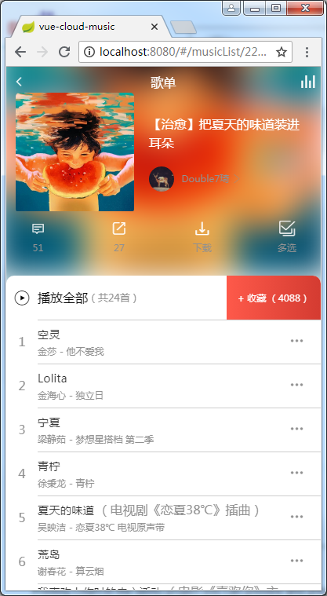
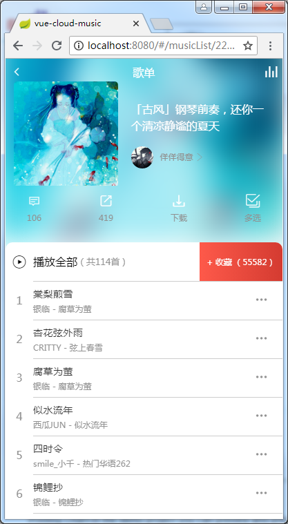
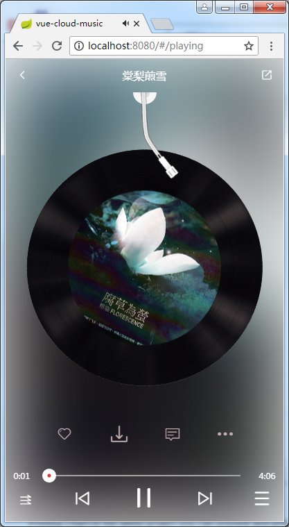
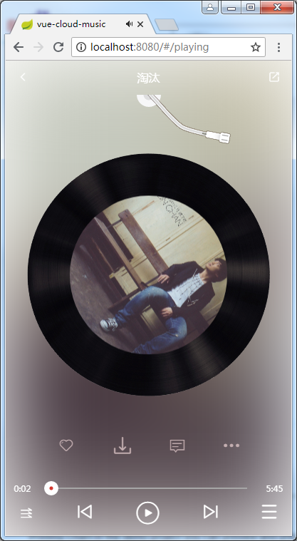

# vue-cloud-music
基于vue + vuex + vue-router + axios的网易云音乐

前瞻图：

项目启发于：[CaiJinyc / vue-music-webapp](https://github.com/CaiJinyc/vue-music-webapp)

后台api使用：[Binaryify / NeteaseCloudMusicApi](https://github.com/Binaryify/NeteaseCloudMusicApi)

ui界面基于ios版，version：5.2.0

项目进度：作业中，未完成，不推荐clone（如果你非要也行）

完成度：(50%)

由于个人原因无法提供在线演示地址，不排除以后会提供，现阶段如果想查看演示的话只能clone本项目。

此项目需要基于[Binaryify](https://github.com/Binaryify/NeteaseCloudMusicApi)的node后台API，所以如果clone了，你还需要继续clone一份[Binaryify](https://github.com/Binaryify/NeteaseCloudMusicApi)的后台api方可。

注意：(由于[Binaryify](https://github.com/Binaryify/NeteaseCloudMusicApi)的后台api持续不断迭代，不同版本之间的api可能会造成前端axios返回的**数据格式**不同，一旦出现了**报错**或者**数据无法正常加载**很可能就是版本不同的原因，请立即**提issue**给本人_(:з」∠)_ ， 另外欢迎pr提出任何你觉得**不足/可改进**的地方⁄(⁄ ⁄•⁄ω⁄•⁄ ⁄)⁄)

还在一边开坑一边填坑中，有好多奇奇怪怪的bug orz

等项目完成后会进行一次READEME的大范围更新。

喜欢的话点个`star`吧
